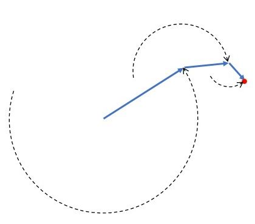

# Epicircles
Procedural art from the path of three nested orbits.

Epicircles are constructed by drawing the path of a point at the end of three nested orbits.

These orbits have their own orbital speed, but have diminishing radii.

This would the same as drawing the path of a satellite orbiting the Moon as seen from the Sun's center.

See the [webpage](https://rschifini.github.io/Epicircles/index.html).
